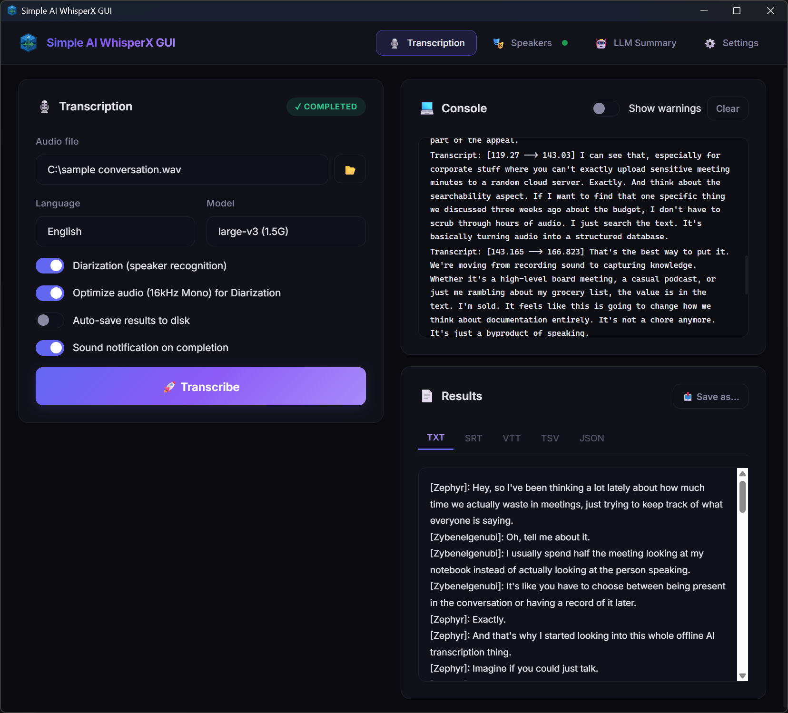

# Simple AI Transcription and Summary GUI for WhisperX

A modern, cross-platform desktop application that provides a user-friendly graphical interface for [WhisperX](https://github.com/m-bain/whisperX) — a fast, accurate speech-to-text engine with word-level timestamps and speaker diarization.

Built with [Tauri](https://tauri.app/), [React](https://react.dev/) and [TypeScript](https://www.typescriptlang.org/). Created by **SpliceBytes**.


<p align="center">
  
</p>

<p align="center"><em>Simple AI WhisperX GUI — main screen</em></p>

---

## 🔒 Who this app is for

This project is built for people looking for an **offline transcription app** with a simple desktop UI and strong privacy defaults.

- **Privacy-conscious users** who want local speech-to-text workflows and do not want to upload recordings to third-party SaaS tools.
- **Journalists, researchers, and legal/health professionals** who often handle sensitive audio and need better control over transcription data.
- **Teams and individuals** searching for a practical **private transcription software** setup powered by WhisperX, with optional local LLM summarization.

In short: if you are searching for a **WhisperX GUI**, **offline speech-to-text**, **local audio transcription**, or **privacy-first transcription tool**, this project is for you.

---

## ✨ Features

- **Audio Transcription** — Transcribe audio files in multiple languages using WhisperX models (tiny → large-v3).
- **Speaker Diarization** — Identify and label different speakers in the audio with playback preview.
- **Speaker Name Assignment** — Listen to voice samples and assign real names to replace SPEAKER_XX labels across all output files.
- **LLM Summaries** — Generate summaries, meeting minutes, or action items from transcriptions using a local LLM (Ollama, LM Studio, or any OpenAI-compatible endpoint).
- **Customizable Prompt Templates** — Create and manage your own prompt templates for LLM summarization.
- **Multiple Output Formats** — Results in TXT, SRT, VTT, TSV, and JSON.
- **Auto-save or Manual Save** — Choose between automatic file saving or on-demand "Save As…".
- **Sound Notifications** — Optional audio notification when processing completes.
- **Cross-platform** — Runs on Windows, macOS, and Linux.

---

## 📋 Prerequisites

Before using this application, you need to have the following installed:

### Required

- **[WhisperX](https://github.com/m-bain/whisperX)** — The core transcription engine.
  Follow the [WhisperX installation guide](https://github.com/m-bain/whisperX#setup) to install it via pip/conda.

- **[FFmpeg](https://ffmpeg.org/)** — Required by WhisperX for audio processing.
  Download from [ffmpeg.org](https://ffmpeg.org/download.html) or install via your package manager.

### Optional

- **[HuggingFace Token](https://huggingface.co/settings/tokens)** — Required for speaker diarization. You also need to accept the terms for:
  - [pyannote/segmentation-3.0](https://huggingface.co/pyannote/segmentation-3.0)
  - [pyannote/speaker-diarization-3.1](https://huggingface.co/pyannote/speaker-diarization-3.1)

- **Local LLM Server** — For transcription summarization. Supported providers:
  - [Ollama](https://ollama.ai/)
  - [LM Studio](https://lmstudio.ai/)
  - Any OpenAI-compatible API endpoint

---

> 💡 **Having trouble?** See the [Troubleshooting Guide](TROUBLESHOOTING.md) for solutions to common installation and setup issues.

## 🚀 Installation

### From Releases (Recommended)

Download the latest installer for your platform from the [Releases](https://github.com/splicebytes/simple-ai-whisperx-gui/releases) page.

### Build from Source

#### Prerequisites

- [Node.js](https://nodejs.org/) (v18+)
- [Rust](https://www.rust-lang.org/tools/install) (latest stable)
- Platform-specific Tauri dependencies — see [Tauri Prerequisites](https://v2.tauri.app/start/prerequisites/)

#### Steps

```bash
# Clone the repository
git clone https://github.com/splicebytes/simple-ai-whisperx-gui.git
cd simple-ai-whisperx-gui

# Install dependencies
npm install

# Run in development mode
npm run tauri dev

# Build for production
npm run tauri build
```

---

## 🖥️ Usage

1. **Settings** — Configure paths to WhisperX and FFmpeg (if not on system PATH), set your HuggingFace token for diarization, and choose your preferred compute device.

2. **Transcription** — Select an audio file, choose the language and model, then click "Transcribe". Results appear in the console and results panel.

3. **Speakers** — After a diarized transcription, listen to voice samples, assign names to speakers, and apply them to all output files.

4. **LLM Summary** — Enable the LLM integration, configure your local LLM endpoint, select a prompt template, and generate summaries from transcriptions.

---

## 🏗️ Tech Stack

| Layer       | Technology                |
|-------------|---------------------------|
| Frontend    | React 19, TypeScript, Vite |
| Backend     | Rust, Tauri 2              |
| Styling     | Vanilla CSS                |
| AI Engine   | WhisperX (Python)          |
| Audio       | FFmpeg                     |
| LLM         | OpenAI-compatible API      |

---

## 🙏 Acknowledgments

This project would not be possible without the incredible work of the open-source community. Special thanks to:

### Core Dependencies

- **[WhisperX](https://github.com/m-bain/whisperX)** by Max Bain et al. — The fast and accurate speech recognition engine with word-level timestamps and speaker diarization that powers this application. Built upon [OpenAI Whisper](https://github.com/openai/whisper).

- **[Tauri](https://tauri.app/)** — The framework that enables building lightweight, secure, cross-platform desktop applications with web technologies and Rust.

- **[FFmpeg](https://ffmpeg.org/)** — The essential multimedia framework used for audio processing, segment extraction, and format conversion.

### AI & ML

- **[OpenAI Whisper](https://github.com/openai/whisper)** — The foundational speech recognition model.
- **[pyannote.audio](https://github.com/pyannote/pyannote-audio)** — Speaker diarization and segmentation models.
- **[HuggingFace](https://huggingface.co/)** — Model hosting and the Transformers ecosystem.

### Frontend

- **[React](https://react.dev/)** — The UI library for building the interactive interface.
- **[Vite](https://vitejs.dev/)** — The fast build tool and development server.
- **[TypeScript](https://www.typescriptlang.org/)** — Type-safe JavaScript for reliable development.
- **[react-markdown](https://github.com/remarkjs/react-markdown)** — Markdown rendering for LLM summary output.

### Backend

- **[Rust](https://www.rust-lang.org/)** — The systems programming language powering the Tauri backend.
- **[Tokio](https://tokio.rs/)** — Async runtime for Rust.
- **[reqwest](https://github.com/seanmonstar/reqwest)** — HTTP client for LLM API communication.
- **[serde](https://serde.rs/)** — Serialization/deserialization framework.

---

## 👨‍💻 Author

Created by **Michał Skalczyński** (aka *skalunek*) for **SpliceBytes**.

We believe in the power of the open-source community and are proud to support and contribute to the ecosystem.

---

## 📄 License

This project is licensed under the MIT License — see the [LICENSE](LICENSE) file for details. 
*Note: The MIT License is highly permissive, but it strictly requires preserving the original copyright notice and license text in any modified or distributed versions.*

---

## 🤝 Contributing

Contributions are welcome! Please feel free to submit a Pull Request. For major changes, please open an issue first to discuss what you would like to change.

1. Fork the repository
2. Create your feature branch (`git checkout -b feature/amazing-feature`)
3. Commit your changes (`git commit -m 'Add amazing feature'`)
4. Push to the branch (`git push origin feature/amazing-feature`)
5. Open a Pull Request
